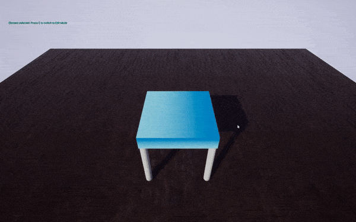

# UFurnitureResize

Hi! This is a demo project which showcases how furniture can be composed with different models (legs, chairs, tables, etc.) and put it together procedurally in an editor fashion.

It features also basic interaction with the scene and a mechanism to apply or not modifications.

# Commands
- MouseLeft: select/interact
- MouseRight: orbit
- MouseWheel: zoom
- Up/Down arrows or W/S: rise/lower visual
- E: **Edit Mode**
- Enter: **Save modifications**
- Backspace: **Abort modifications**
